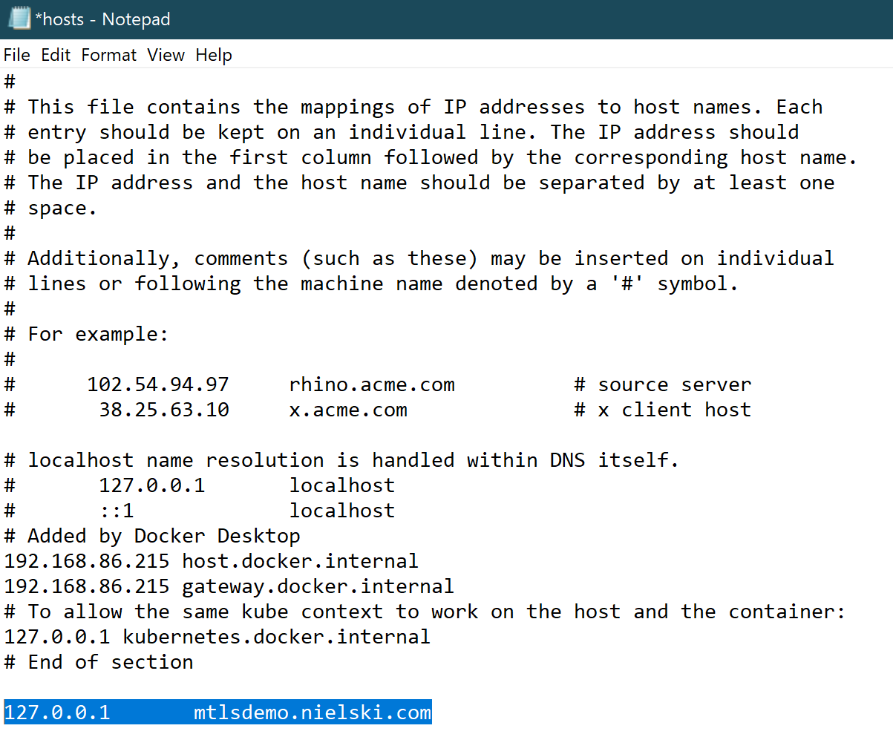

# Certificate Authentication Demo

This is a sample web application that demonstrates certificate-based authentication as part of the TLS connection negotiation process. This is sometimes referred to as Mutual TLS. It includes scripts that create and deploy a test certificate chain and client certificate in your environment.

## Build and Run

## Configure Certificates

From a PowerShell console in elevated (as Administrator) mode, run `create-certs.ps1` to generate the certificate authorities (root and intermediate), web server certificate, and client certificates.

These certificates should be tested using their DNS names. In order to do this locally or in Azure, modify your HOSTS file as shown in the following example:



### Docker

If you wish to package and run the web app in Docker, ensure Docker Desktop is started in your local environment and run the following commands from the `src` directory:

```bash
docker build -t [your_docker_id]/certauthweb .
docker run -d -p 8080:8080 -p 8443:8443 -p 8444:8444 [your_docker_id]/certauthweb:latest
```

You can test the applicaiton by navigating to: `https://your-dns-name:8444` from your browser. You should be prompted to supply a certificate before the page loads. Once you have confirmed the application, you can publish it to Docker Hub via the `docker push` command. Example:

```bash
docker push [your_docker_id]/certauthweb
```

## Deploy

Use the following Azure CLI commands to Azure Container Intance (ACI):

```bash
az login
az group create --name certauthdemo --location centralus
az container create -g certauthdemo --name certauthweb --image [your_dockerid]/certauthweb:latest --cpu 1 --memory 1 --os-type Linux --ports 8080 8443 8444 --dns-name-label "[your_dockerid]-certauth"
```

After deployment, modify your HOSTS file to reflect the public IP address assigned by ACI. You should now be able to access the site over HTTPS via ports 8443 and 8444.
